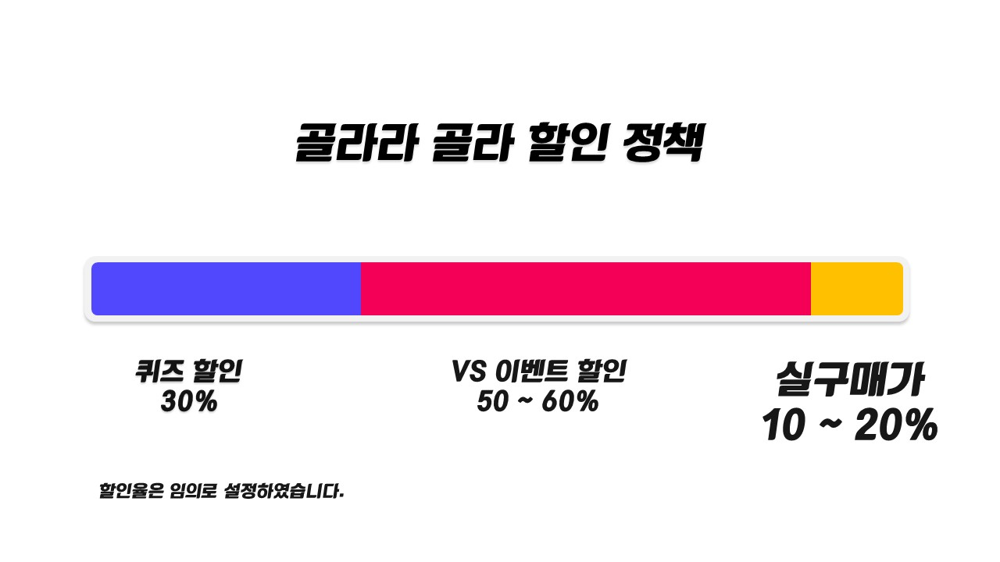
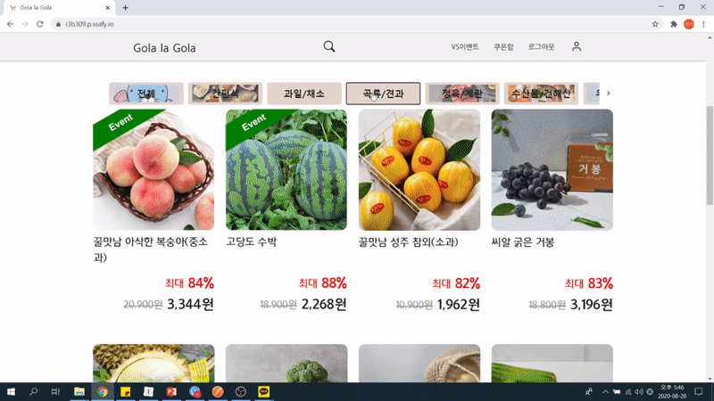
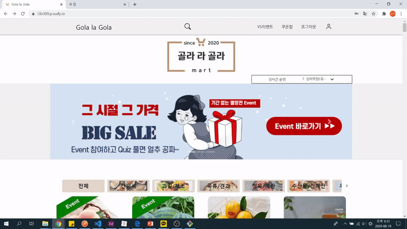
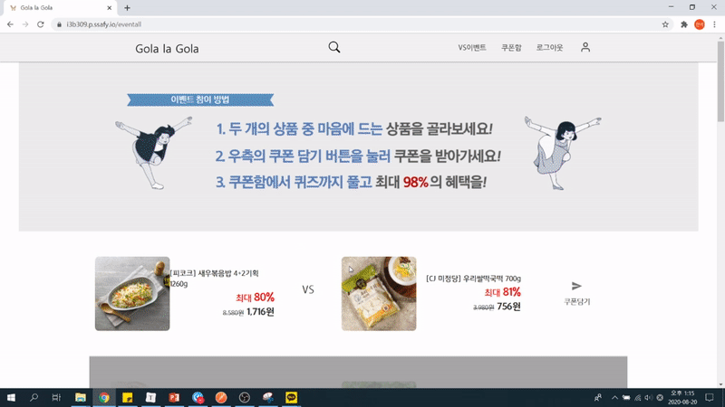
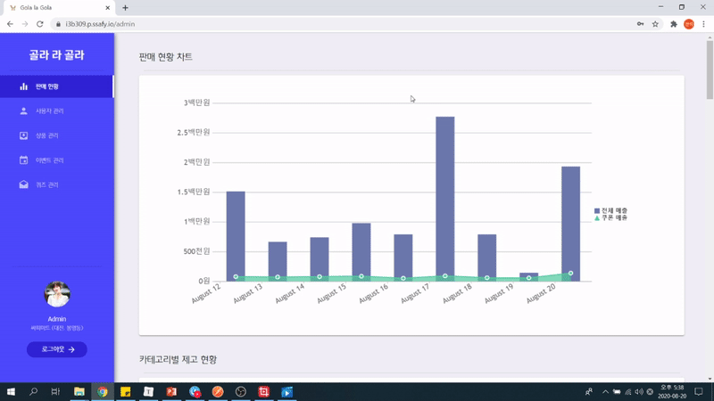

# Gola la Gola(골라라 골라)

> 배포 주소: http://ec2-3-129-217-136.us-east-2.compute.amazonaws.com/ 
> 
> UCC 보러가기: https://www.youtube.com/watch?v=1Tk_EgY8Pv8

 

 

 

Table of Contents
-----------------

* [역할 및 기술스택](#1-역할-및-기술스택)
* [골라라 골라는?](#2-골라라-골라는)
* [골라라 골라 기획의도](#3-골라라-골라-기획의도)
  * [문제 의식](#문제-의식)
  * [목적 및 주요 타겟](#목적-및-주요-타겟)
* [골라라 골라 주요기능](#4-골라라-골라-주요기능)
  * [키오스크](#키오스크)
  * [메인페이지 & 검색](#메인페이지--검색)
  * [디테일 페이지](#디테일-페이지)
  * [VS 이벤트 모아보기](#VS-이벤트-모아보기)
  * [관리자 페이지](#관리자-페이지)
  * [결제하기](#결제하기)

 

 

 

## 1. 역할 및 기술스택

### 주요 역할

Fullstack 개발 - 서비스 UX 기획, Frontend 페이지 제작([관리자 페이지](#관리자-페이지), [VS 이벤트 모아보기](#VS-이벤트-모아보기)), Backend 개발

### 기술스택

 

 

 

## 2. 골라라 골라는?

- 코로나로 얼어붙은 오프라인 소비를 독려하고 마트 재고를 관리할 수 있게 하는 플랫폼

- 판매자는 재고관리 및 기회비용 절감의 기회를 제공하고, 소비자는 쿠폰 발급으로 싼 가격에 질좋은 상품 구매할 수 있게 하는 서비스

 

 

 

## 3. 골라라 골라 기획의도

### 문제 의식

- #### 소비자

  - 큰 소비를 꺼려하게 되면서 가격 만족도가 높은 상품을 찾고있다.
  - 저렴한 물품들의 정보를 얻고, 이를 구매하고 싶어도 대량으로 주문하여 배송 가능한 온라인 쇼핑몰 밖에 없다. 주거지 주변 상권에서 해당 정보를 찾기 어렵다. 

- #### 판매자

  - 코로나 여파로 오프라인 소비가 줄어들었다. 때문에 지역 상권이 위축되어 재고관리비용이 증가해 소상공인들의 어려움이 크다.
  - 온라인 쇼핑몰을 갖지 못한 소상공인은 판매를 오직 오프라인으로만 진행해야 하며, 남는 재고상품에 대한 정보를 제공할 커넥션이 부족하다.

  

### 목적 및 주요 타겟

  - 마트에서 나오는 재고 상품을 소비자들에게 싼 가격에 제공할 수 있도록 웹, Kiosk 를 이용한 서비스로 소비자에게 만족도 높은 소비를 촉진시키고자 한다.
  - 지역 상권의 점주들과 해당 상권을 이용하고자 하는 소비자들 (주부, 20, 30 대 대학생 및 사회 초년생)

 

 

 

## 4. 골라라 골라 주요기능

- 오프라인 매장의 재고들을 대상으로 큰폭의 할인을 받을 수 있도록 쿠폰을 발급합니다. (현재 서비스는 특정 매장을 가정하여 제작하였습니다.)
- 오프라인 매장의 키오스크 또는 웹에서 발급 받을 수 있습니다.
- 쿠폰에는 2가지 종류가 있습니다. 소비자는 두가지 쿠폰을 활용하여 최대 90%까지 할인을 받을 수 있습니다.

쿠폰 종류        | 발급방법                                                     | 대상 품목        | 할인율(가정, 최대 할인율 기준) 
---------------- | ------------------------------------------------------------ | ---------------- | ------------------------------ 
VS 이벤트 쿠폰   | 유사한 두가지 재고상품에 대한 행사를 진행할 수 있습니다.  두가지 상품 중 한가지 상품을 골라 큰폭의 할인을 받을 수 있습니다. | 선택한 재고 상품 | 50% ~ 60%
퀴즈 이벤트 쿠폰 | 매장에 관련된 퀴즈를 풀고 전체 재고상품을 할인받을 수 있습니다. | 전체 재고 상품   | 30%

 

 

 

### 키오스크

> 매장의 키오스크에서 할인쿠폰을 발급받을 수 있고, 골라라 골라 서비스의 홈페이지로 접속할 수 있는 QR코드를 제공합니다.

 

 

 

### 메인페이지 & 검색

> http://ec2-3-129-217-136.us-east-2.compute.amazonaws.com/
>
> 매장에 존재하는 재고 정보를 확인, 검색할 수 있습니다.

 

 

 

### 디테일 페이지

> 재고 상품에 대한 2가지 쿠폰을 발급받을 수 있습니다.

 

 

 

### VS 이벤트 모아보기

> http://ec2-3-129-217-136.us-east-2.compute.amazonaws.com/eventall
>
> VS 이벤트를 진행중인 상품들을 모아보고, 한번에 쿠폰을 발급받을 수 있습니다.

 

 

 

### 관리자 페이지

> 매장의 매출, 재고, 이벤트 참여현황 등을 확인할 수 있습니다.

 

 

 

### 결제하기

> 발급받은 쿠폰을 사용하여 할인된 가격으로 결제합니다.

 

 

 

## License

> ### 해당 홈페이지는 비영리 목적으로 제작되었으며, 모든 내용들은 허구임을 밝힙니다.
>
> 배너 관련 이미지들은 미리캔버스를 참조하였으며, 모든 저작권은 미리캔버스에 있습니다. 
>
> https://miricanvas.zendesk.com/hc/ko/articles/360040600891"
>
> 상품 관련 내용과 이미지들은 SSG.COM을 참조하였으며, 모든 저작권은 SSG.COM에 있습니다.
>
> https://member.ssg.com/policies/terms.ssg#ag_24
